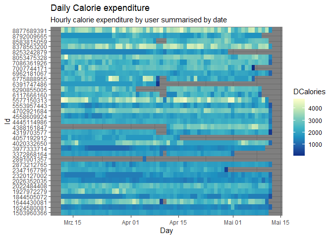

Data Cleaning and manipulation
================
Jeronimo Miranda
2023-05-16

## Data Loading

I will load the corresponding files from both folders and merge them
using rbind. I will only show the code for loading and merging for
dailyActivity, because it is repetitive, but will show the summaries and
cleaning for all. In any case, the code is still in the .Rmd file.

``` r
data_path_A <- "../Fitabase Data 3.12.16-4.11.16/"
data_path_B <- "../Fitabase Data 4.12.16-5.12.16/"
dailyActivity_A <- read_csv(paste0(data_path_A,"dailyActivity_merged.csv"), 
    col_types = cols(Id = col_character(), 
        ActivityDate = col_date(format = "%m/%d/%Y")))

dailyActivity_B <- read_csv(paste0(data_path_B,"dailyActivity_merged.csv"), 
    col_types = cols(Id = col_character(), 
        ActivityDate = col_date(format = "%m/%d/%Y")))
```

We also have a problem at the intersection of the two date ranges. There
are duplicate entries at 2016-04-12 for many Ids. We will remove this
date in the first object because the data is supposed to go only to
2016-04-11. Aditionally, will remove the intermediate objects, once
merged (the rm() function).

``` r
dailyActivity_A <- dailyActivity_A %>% filter(ActivityDate < ymd(20160412))
dailyActivity <- rbind(dailyActivity_A, dailyActivity_B)
rm(dailyActivity_A)
rm(dailyActivity_B)
skim_without_charts(dailyActivity)
```

    ## Warning in kable_pipe(x = structure(c("Name", "Number of rows", "Number of
    ## columns", : The table should have a header (column names)

|                                                  |               |
|:-------------------------------------------------|:--------------|
| Name                                             | dailyActivity |
| Number of rows                                   | 1373          |
| Number of columns                                | 15            |
| \_\_\_\_\_\_\_\_\_\_\_\_\_\_\_\_\_\_\_\_\_\_\_   |               |
| Column type frequency:                           |               |
| character                                        | 1             |
| Date                                             | 1             |
| numeric                                          | 13            |
| \_\_\_\_\_\_\_\_\_\_\_\_\_\_\_\_\_\_\_\_\_\_\_\_ |               |
| Group variables                                  | None          |

Data summary

**Variable type: character**

| skim_variable | n_missing | complete_rate | min | max | empty | n_unique | whitespace |
|:--------------|----------:|--------------:|----:|----:|------:|---------:|-----------:|
| Id            |         0 |             1 |  10 |  10 |     0 |       35 |          0 |

**Variable type: Date**

| skim_variable | n_missing | complete_rate | min        | max        | median     | n_unique |
|:--------------|----------:|--------------:|:-----------|:-----------|:-----------|---------:|
| ActivityDate  |         0 |             1 | 2016-03-12 | 2016-05-12 | 2016-04-19 |       62 |

**Variable type: numeric**

| skim_variable            | n_missing | complete_rate |    mean |      sd |  p0 |     p25 |     p50 |      p75 |     p100 |
|:-------------------------|----------:|--------------:|--------:|--------:|----:|--------:|--------:|---------:|---------:|
| TotalSteps               |         0 |             1 | 7377.38 | 5198.13 |   0 | 3321.00 | 7142.00 | 10645.00 | 36019.00 |
| TotalDistance            |         0 |             1 |    5.29 |    3.99 |   0 |    2.28 |    5.03 |     7.57 |    28.03 |
| TrackerDistance          |         0 |             1 |    5.26 |    3.97 |   0 |    2.27 |    5.02 |     7.57 |    28.03 |
| LoggedActivitiesDistance |         0 |             1 |    0.13 |    0.70 |   0 |    0.00 |    0.00 |     0.00 |     6.73 |
| VeryActiveDistance       |         0 |             1 |    1.41 |    2.62 |   0 |    0.00 |    0.12 |     1.86 |    21.92 |
| ModeratelyActiveDistance |         0 |             1 |    0.55 |    0.87 |   0 |    0.00 |    0.20 |     0.78 |     6.48 |
| LightActiveDistance      |         0 |             1 |    3.24 |    2.10 |   0 |    1.73 |    3.28 |     4.71 |    12.51 |
| SedentaryActiveDistance  |         0 |             1 |    0.00 |    0.01 |   0 |    0.00 |    0.00 |     0.00 |     0.11 |
| VeryActiveMinutes        |         0 |             1 |   19.87 |   31.82 |   0 |    0.00 |    2.00 |    30.00 |   210.00 |
| FairlyActiveMinutes      |         0 |             1 |   13.60 |   26.58 |   0 |    0.00 |    6.00 |    18.00 |   660.00 |
| LightlyActiveMinutes     |         0 |             1 |  188.10 |  113.10 |   0 |  117.00 |  196.00 |   263.00 |   720.00 |
| SedentaryMinutes         |         0 |             1 | 1001.35 |  304.17 |   0 |  734.00 | 1062.00 |  1246.00 |  1440.00 |
| Calories                 |         0 |             1 | 2294.81 |  725.53 |   0 | 1820.00 | 2129.00 |  2781.00 |  4900.00 |

### Daily sleep

Interestingly, there is no daily sleep data for the 3.11 - 4.11 period.

``` r
sleepDay <- read_csv(paste0(data_path_B,"sleepDay_merged.csv"), 
    col_types = cols(Id = col_character(), 
        SleepDay = col_datetime(format = "%m/%d/%Y %H:%M:%S %p")))
skim_without_charts(sleepDay)
```

    ## Warning in kable_pipe(x = structure(c("Name", "Number of rows", "Number of
    ## columns", : The table should have a header (column names)

|                                                  |          |
|:-------------------------------------------------|:---------|
| Name                                             | sleepDay |
| Number of rows                                   | 413      |
| Number of columns                                | 5        |
| \_\_\_\_\_\_\_\_\_\_\_\_\_\_\_\_\_\_\_\_\_\_\_   |          |
| Column type frequency:                           |          |
| character                                        | 1        |
| numeric                                          | 3        |
| POSIXct                                          | 1        |
| \_\_\_\_\_\_\_\_\_\_\_\_\_\_\_\_\_\_\_\_\_\_\_\_ |          |
| Group variables                                  | None     |

Data summary

**Variable type: character**

| skim_variable | n_missing | complete_rate | min | max | empty | n_unique | whitespace |
|:--------------|----------:|--------------:|----:|----:|------:|---------:|-----------:|
| Id            |         0 |             1 |  10 |  10 |     0 |       24 |          0 |

**Variable type: numeric**

| skim_variable      | n_missing | complete_rate |   mean |     sd |  p0 | p25 | p50 | p75 | p100 |
|:-------------------|----------:|--------------:|-------:|-------:|----:|----:|----:|----:|-----:|
| TotalSleepRecords  |         0 |             1 |   1.12 |   0.35 |   1 |   1 |   1 |   1 |    3 |
| TotalMinutesAsleep |         0 |             1 | 419.47 | 118.34 |  58 | 361 | 433 | 490 |  796 |
| TotalTimeInBed     |         0 |             1 | 458.64 | 127.10 |  61 | 403 | 463 | 526 |  961 |

**Variable type: POSIXct**

| skim_variable | n_missing | complete_rate | min        | max        | median     | n_unique |
|:--------------|----------:|--------------:|:-----------|:-----------|:-----------|---------:|
| SleepDay      |         0 |             1 | 2016-04-12 | 2016-05-12 | 2016-04-27 |       31 |

### Weight info

Weight info is absent in the 3.11 - 4.11 period too

``` r
skim_without_charts(weightLogInfo)
```

|                                                  |               |
|:-------------------------------------------------|:--------------|
| Name                                             | weightLogInfo |
| Number of rows                                   | 67            |
| Number of columns                                | 8             |
| \_\_\_\_\_\_\_\_\_\_\_\_\_\_\_\_\_\_\_\_\_\_\_   |               |
| Column type frequency:                           |               |
| character                                        | 1             |
| logical                                          | 1             |
| numeric                                          | 5             |
| POSIXct                                          | 1             |
| \_\_\_\_\_\_\_\_\_\_\_\_\_\_\_\_\_\_\_\_\_\_\_\_ |               |
| Group variables                                  | None          |

Data summary

**Variable type: character**

| skim_variable | n_missing | complete_rate | min | max | empty | n_unique | whitespace |
|:--------------|----------:|--------------:|----:|----:|------:|---------:|-----------:|
| Id            |         0 |             1 |  10 |  10 |     0 |        8 |          0 |

**Variable type: logical**

| skim_variable  | n_missing | complete_rate | mean | count            |
|:---------------|----------:|--------------:|-----:|:-----------------|
| IsManualReport |         0 |             1 | 0.61 | TRU: 41, FAL: 26 |

**Variable type: numeric**

| skim_variable | n_missing | complete_rate |         mean |            sd |           p0 |          p25 |          p50 |          p75 |         p100 |
|:--------------|----------:|--------------:|-------------:|--------------:|-------------:|-------------:|-------------:|-------------:|-------------:|
| WeightKg      |         0 |          1.00 | 7.204000e+01 |         13.92 | 5.260000e+01 | 6.140000e+01 | 6.250000e+01 | 8.505000e+01 | 1.335000e+02 |
| WeightPounds  |         0 |          1.00 | 1.588100e+02 |         30.70 | 1.159600e+02 | 1.353600e+02 | 1.377900e+02 | 1.875000e+02 | 2.943200e+02 |
| Fat           |        65 |          0.03 | 2.350000e+01 |          2.12 | 2.200000e+01 | 2.275000e+01 | 2.350000e+01 | 2.425000e+01 | 2.500000e+01 |
| BMI           |         0 |          1.00 | 2.519000e+01 |          3.07 | 2.145000e+01 | 2.396000e+01 | 2.439000e+01 | 2.556000e+01 | 4.754000e+01 |
| LogId         |         0 |          1.00 | 1.461772e+12 | 782994783\.61 | 1.460444e+12 | 1.461079e+12 | 1.461802e+12 | 1.462375e+12 | 1.463098e+12 |

**Variable type: POSIXct**

| skim_variable | n_missing | complete_rate | min                 | max                 | median              | n_unique |
|:--------------|----------:|--------------:|:--------------------|:--------------------|:--------------------|---------:|
| Date          |         0 |             1 | 2016-04-12 06:47:11 | 2016-05-12 23:59:59 | 2016-04-27 23:59:59 |       56 |

### Hourly data

``` r
skim_without_charts(hourlyActivity)
```

|                                                  |                |
|:-------------------------------------------------|:---------------|
| Name                                             | hourlyActivity |
| Number of rows                                   | 46008          |
| Number of columns                                | 6              |
| \_\_\_\_\_\_\_\_\_\_\_\_\_\_\_\_\_\_\_\_\_\_\_   |                |
| Column type frequency:                           |                |
| character                                        | 1              |
| numeric                                          | 4              |
| POSIXct                                          | 1              |
| \_\_\_\_\_\_\_\_\_\_\_\_\_\_\_\_\_\_\_\_\_\_\_\_ |                |
| Group variables                                  | None           |

Data summary

**Variable type: character**

| skim_variable | n_missing | complete_rate | min | max | empty | n_unique | whitespace |
|:--------------|----------:|--------------:|----:|----:|------:|---------:|-----------:|
| Id            |         0 |             1 |  10 |  10 |     0 |       35 |          0 |

**Variable type: numeric**

| skim_variable    | n_missing | complete_rate |   mean |     sd |  p0 | p25 |   p50 |    p75 |  p100 |
|:-----------------|----------:|--------------:|-------:|-------:|----:|----:|------:|-------:|------:|
| Calories         |         0 |             1 |  95.82 |  60.04 |  42 |  62 | 80.00 | 106.00 |   948 |
| TotalIntensity   |         0 |             1 |  11.42 |  20.72 |   0 |   0 |  2.00 |  15.00 |   180 |
| AverageIntensity |         0 |             1 |   0.19 |   0.35 |   0 |   0 |  0.03 |   0.25 |     3 |
| StepTotal        |         0 |             1 | 302.87 | 677.30 |   0 |   0 | 21.00 | 323.00 | 10565 |

**Variable type: POSIXct**

| skim_variable | n_missing | complete_rate | min        | max                 | median              | n_unique |
|:--------------|----------:|--------------:|:-----------|:--------------------|:--------------------|---------:|
| ActivityHour  |         0 |             1 | 2016-03-12 | 2016-05-12 15:00:00 | 2016-04-10 10:30:00 |     1480 |

### Minute data

I will only check the narrow minute files.

``` r
minuteActivity <- inner_join(minuteCalories, minuteIntensities, by = c("Id","ActivityMinute")) %>% inner_join(minuteSteps, by = c("Id", "ActivityMinute"))
skim_without_charts(minuteActivity)
```

|                                                  |                |
|:-------------------------------------------------|:---------------|
| Name                                             | minuteActivity |
| Number of rows                                   | 2833620        |
| Number of columns                                | 5              |
| \_\_\_\_\_\_\_\_\_\_\_\_\_\_\_\_\_\_\_\_\_\_\_   |                |
| Column type frequency:                           |                |
| character                                        | 1              |
| numeric                                          | 3              |
| POSIXct                                          | 1              |
| \_\_\_\_\_\_\_\_\_\_\_\_\_\_\_\_\_\_\_\_\_\_\_\_ |                |
| Group variables                                  | None           |

Data summary

**Variable type: character**

| skim_variable | n_missing | complete_rate | min | max | empty | n_unique | whitespace |
|:--------------|----------:|--------------:|----:|----:|------:|---------:|-----------:|
| Id            |         0 |             1 |  10 |  10 |     0 |       35 |          0 |

**Variable type: numeric**

| skim_variable | n_missing | complete_rate | mean |    sd |  p0 |  p25 |  p50 |  p75 |   p100 |
|:--------------|----------:|--------------:|-----:|------:|----:|-----:|-----:|-----:|-------:|
| Calories      |         0 |             1 | 1.59 |  1.38 |   0 | 0.94 | 1.22 | 1.43 |  23.01 |
| Intensity     |         0 |             1 | 0.19 |  0.51 |   0 | 0.00 | 0.00 | 0.00 |   3.00 |
| Steps         |         0 |             1 | 5.00 | 17.62 |   0 | 0.00 | 0.00 | 0.00 | 220.00 |

**Variable type: POSIXct**

| skim_variable  | n_missing | complete_rate | min        | max                 | median              | n_unique |
|:---------------|----------:|--------------:|:-----------|:--------------------|:--------------------|---------:|
| ActivityMinute |         0 |             1 | 2016-03-12 | 2016-05-12 15:59:00 | 2016-04-11 11:16:00 |    88800 |

### Heart rate data

``` r
skim_without_charts(heartrate_seconds)
```

|                                                  |                   |
|:-------------------------------------------------|:------------------|
| Name                                             | heartrate_seconds |
| Number of rows                                   | 3638339           |
| Number of columns                                | 3                 |
| \_\_\_\_\_\_\_\_\_\_\_\_\_\_\_\_\_\_\_\_\_\_\_   |                   |
| Column type frequency:                           |                   |
| character                                        | 1                 |
| numeric                                          | 1                 |
| POSIXct                                          | 1                 |
| \_\_\_\_\_\_\_\_\_\_\_\_\_\_\_\_\_\_\_\_\_\_\_\_ |                   |
| Group variables                                  | None              |

Data summary

**Variable type: character**

| skim_variable | n_missing | complete_rate | min | max | empty | n_unique | whitespace |
|:--------------|----------:|--------------:|----:|----:|------:|---------:|-----------:|
| Id            |         0 |             1 |  10 |  10 |     0 |       15 |          0 |

**Variable type: numeric**

| skim_variable | n_missing | complete_rate | mean |    sd |  p0 | p25 | p50 | p75 | p100 |
|:--------------|----------:|--------------:|-----:|------:|----:|----:|----:|----:|-----:|
| Value         |         0 |             1 | 78.1 | 19.23 |  36 |  64 |  74 |  88 |  203 |

**Variable type: POSIXct**

| skim_variable | n_missing | complete_rate | min                 | max                 | median              | n_unique |
|:--------------|----------:|--------------:|:--------------------|:--------------------|:--------------------|---------:|
| Time          |         0 |             1 | 2016-03-29 00:00:05 | 2016-05-12 16:20:00 | 2016-04-19 17:30:00 |  1456216 |

## Plotting a few explorations

What’s the relationship between steps taken in a day and sedentary
minutes? How could this help inform the customer segments that we can
market to? E.g. position this more as a way to get started in walking
more? Or to measure steps that you’re already taking?

``` r
ggplot(data=dailyActivity, aes(x=TotalSteps, y=SedentaryMinutes)) + geom_point()
```

<!-- -->

What’s the relationship between minutes asleep and time in bed? You
might expect it to be almost completely linear - are there any
unexpected trends?

``` r
ggplot(data=sleepDay, aes(x=TotalMinutesAsleep, y=TotalTimeInBed)) + geom_point()
```

<!-- -->

What could these trends tell you about how to help market this product?
Or areas where you might want to explore further?

## Data validation and cleaning

#### Checking Ids

Checking the he skim without charts tables shows that no Id data is
missing for any row, and that all have 10 characters. Next, I want to
make sure that there are no misspelings such that an Id in a dataset has
no correspondance to another. First, we will take the 35 unique Ids in
the `dailyActivity` table as our reference. Then, we will use set union
or set equality to check that there are no extra Ids in the other
datasets.

``` r
uniqueIds <- unique(dailyActivity$Id)
### Datasets with the full 35 participants
#Hour data
setequal(uniqueIds, unique(hourlyActivity$Id))
```

    ## [1] TRUE

``` r
#Minute data
setequal(uniqueIds, unique(minuteActivity$Id))
```

    ## [1] TRUE

``` r
### Datasets with some participants missing
#heart rate
union(uniqueIds, unique(heartrate_seconds$Id)) %>% length
```

    ## [1] 35

``` r
#weight
union(uniqueIds, unique(weightLogInfo$Id)) %>% length
```

    ## [1] 35

``` r
#sleep
union(uniqueIds, unique(sleepDay$Id)) %>% length
```

    ## [1] 35

TRUE for set equal means the set of Ids are identical. For the
incomplete data sets heart rate, weight and sleep, we know some Ids are
missing. In these cases we do set union, which would give a list longer
than 35 if the Ids from those data sets were not completely included in
the reference.

### Checking dates

We know that dates are correct because of how we imported them with
readr. If any data had not been recognized, they would have shown as
missing values in the skim without charts tables. What I am interested
is in the range of dates we have. We will use the geom tile as a nice
way to plot each day with its calorie expenditure value.

<!-- -->

I love this graph because it immediately tells a lot of info: why it was
decided to cut the original kaggle dataset from april 12, which users
have gaps, and suspicious days of very low calorie expenditure. It is a
sort of conditional formatting for the data. I prefer to keep all
available dates for now, because there is no need for the data to be
exactly simultaneous.

Nevertheless, I will cut out the 9 days of **zero** calorie expenditure,
since that is physically very unlikely and indicates an artifact. We
also check there is only one record per date per Id. Our final sanity
check for this data set is to sum the total number of minutes of all
activity types, and check that it is not greater than 1440, which is the
total number of minutes in a date.

``` r
dailyActivity <- dailyActivity %>% filter(Calories > 1)

#Check that there are no Id, Date duplicate records
get_dupes(dailyActivity, Id, ActivityDate)
```

    ## No duplicate combinations found of: Id, ActivityDate

    ## # A tibble: 0 x 16
    ## # ... with 16 variables: Id <chr>, ActivityDate <date>, dupe_count <int>,
    ## #   TotalSteps <dbl>, TotalDistance <dbl>, TrackerDistance <dbl>,
    ## #   LoggedActivitiesDistance <dbl>, VeryActiveDistance <dbl>,
    ## #   ModeratelyActiveDistance <dbl>, LightActiveDistance <dbl>,
    ## #   SedentaryActiveDistance <dbl>, VeryActiveMinutes <dbl>,
    ## #   FairlyActiveMinutes <dbl>, LightlyActiveMinutes <dbl>,
    ## #   SedentaryMinutes <dbl>, Calories <dbl>

``` r
#Check that the sum of minutes does not exceed the total minutes in a day
dailyActivity %>% mutate(totalMinutes = VeryActiveMinutes + FairlyActiveMinutes + LightlyActiveMinutes + SedentaryMinutes) %>% filter(totalMinutes > 24 * 60)
```

    ## # A tibble: 0 x 16
    ## # ... with 16 variables: Id <chr>, ActivityDate <date>, TotalSteps <dbl>,
    ## #   TotalDistance <dbl>, TrackerDistance <dbl>, LoggedActivitiesDistance <dbl>,
    ## #   VeryActiveDistance <dbl>, ModeratelyActiveDistance <dbl>,
    ## #   LightActiveDistance <dbl>, SedentaryActiveDistance <dbl>,
    ## #   VeryActiveMinutes <dbl>, FairlyActiveMinutes <dbl>,
    ## #   LightlyActiveMinutes <dbl>, SedentaryMinutes <dbl>, Calories <dbl>,
    ## #   totalMinutes <dbl>

#### Sleep data

Sleep data is very irregular and it is not clear why. There is also a
tendency for the users with very few days to have too little or too much
sleep. I will not filter out these users because there is also
information of how they use the device, so it is useful. It has to be
kept in mind when analyzing the sleep durations, though. The number of
minutes sleeping in general seems plausible.

<!-- -->

The sanity checks are no record Id/SleepDay duplication and that minutes
in a day do not exceed $60 * 24 = 1440$, although we have already seen
this is not the case in the skim_without_charts summary.

``` r
get_dupes(sleepDay, Id, SleepDay)
```

    ## # A tibble: 6 x 6
    ##   Id         SleepDay            dupe_count TotalSleepRecords TotalMin~1 Total~2
    ##   <chr>      <dttm>                   <int>             <dbl>      <dbl>   <dbl>
    ## 1 4388161847 2016-05-05 00:00:00          2                 1        471     495
    ## 2 4388161847 2016-05-05 00:00:00          2                 1        471     495
    ## 3 4702921684 2016-05-07 00:00:00          2                 1        520     543
    ## 4 4702921684 2016-05-07 00:00:00          2                 1        520     543
    ## 5 8378563200 2016-04-25 00:00:00          2                 1        388     402
    ## 6 8378563200 2016-04-25 00:00:00          2                 1        388     402
    ## # ... with abbreviated variable names 1: TotalMinutesAsleep, 2: TotalTimeInBed

``` r
##There are duplicate rows
sleepDay <- distinct(sleepDay)

sleepDay %>% filter(TotalMinutesAsleep >= 1440, TotalTimeInBed >= 1440)
```

    ## # A tibble: 0 x 5
    ## # ... with 5 variables: Id <chr>, SleepDay <dttm>, TotalSleepRecords <dbl>,
    ## #   TotalMinutesAsleep <dbl>, TotalTimeInBed <dbl>

#### Checking the date time in the hourly data

Checking for duplicates of Id/hour combination. Interestingly, there are
no hours with zero calories, which is perplexing given that I thought
the daily activity file was just a summary from this one.

``` r
hourlyActivity %>% get_dupes(Id, ActivityHour)
```

    ## No duplicate combinations found of: Id, ActivityHour

    ## # A tibble: 0 x 7
    ## # ... with 7 variables: Id <chr>, ActivityHour <dttm>, dupe_count <int>,
    ## #   Calories <dbl>, TotalIntensity <dbl>, AverageIntensity <dbl>,
    ## #   StepTotal <dbl>

``` r
#zero calory hours
filter(hourlyActivity, Calories == 0)
```

    ## # A tibble: 0 x 6
    ## # ... with 6 variables: Id <chr>, ActivityHour <dttm>, Calories <dbl>,
    ## #   TotalIntensity <dbl>, AverageIntensity <dbl>, StepTotal <dbl>

``` r
# days with more than 24 hours. Not really needed, only possible if get_dupes had returned something
hourlyActivity %>% mutate(Day = date(ActivityHour)) %>% group_by(Id, Day) %>% summarise(number_of_hours = n()) %>% filter(number_of_hours > 24)
```

    ## `summarise()` has grouped output by 'Id'. You can override using the `.groups`
    ## argument.

    ## # A tibble: 0 x 3
    ## # Groups:   Id [0]
    ## # ... with 3 variables: Id <chr>, Day <date>, number_of_hours <int>

We will not graph all the hours, instead we will group by day.

<!-- -->

This is really baffling. There is Calories data for almost all users for
the first half of the study, the data is collected for 24 hours except
on the last days. This data is missing in the DailyActivity (compare
with the previous graphs). This might be due to the lack of Distance
data for the relevant dates. Nevertheless, it could be useful to use
this aggregated data if we only want to look at Calories or steps.
Lastly, we might consider getting rid of Id “2891001357” with too few
data points, but we will wait until we check the minute-level data.

Next, we will compare this aggregated data set with the existing
dailyActivity data frame. We use a left join to keep only the dates that
exist in the original dailyActivity.

<!-- -->

Most days coincide, some error could be expected due to aggregation
issues or rounding. But what about the substantial divergences? I am
tempted to delete the outliers, but I will wait until the minute-level
comparison. The biggest discrepancies occur in days that are not on the
edges and that have the full 24 hours. One of these days is also the
maximum calories in the activity data,. The other is an instance in
which the number of sedentary minutes is 1440 (The whole day), yet the
distance and number of steps are huge. Therefore it is possible that it
is just wrong.

    ## # A tibble: 1 x 7
    ##   Id         ActivityDate diffCal Calories TotalSteps diffSteps number_of_hours
    ##   <chr>      <date>         <dbl>    <dbl>      <dbl>     <dbl>           <int>
    ## 1 8583815059 2016-05-03      1196     3212      12015     12015              24

    ## # A tibble: 1 x 7
    ##   Id         ActivityDate diffCal Calories TotalSteps diffSteps number_of_hours
    ##   <chr>      <date>         <dbl>    <dbl>      <dbl>     <dbl>           <int>
    ## 1 6117666160 2016-04-21      2535     4900      19542     10449              24

Note that there were more participant Ids in the daily activity dataset
that have been filtered out using merge. Consider using ‘outer_join’ to
keep those in the dataset.

Now you can explore some different relationships between activity and
sleep as well. For example, do you think participants who sleep more
also take more steps or fewer steps per day? Is there a relationship at
all? How could these answers help inform the marketing strategy of how
you position this new product?

This is just one example of how to get started with this data - there
are many other files and questions to explore as well!
