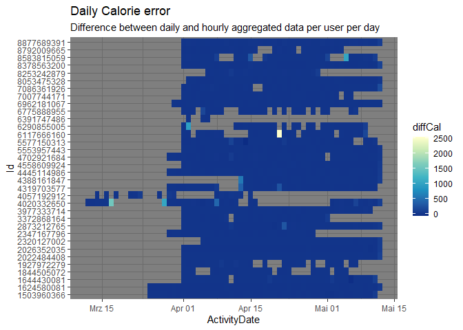

Data Cleaning and manipulation
================
Jeronimo Miranda
2023-05-16

## Data Loading

I will load the corresponding files from both folders and merge them
using rbind. I will only show the code for loading and merging for
dailyActivity, because it is repetitive, but will show the summaries and
cleaning for all. In any case, the code is still in the .Rmd file.

``` r
data_path_A <- "../Fitabase Data 3.12.16-4.11.16/"
data_path_B <- "../Fitabase Data 4.12.16-5.12.16/"
dailyActivity_A <- read_csv(paste0(data_path_A,"dailyActivity_merged.csv"), 
    col_types = cols(Id = col_character(), 
        ActivityDate = col_date(format = "%m/%d/%Y")))

dailyActivity_B <- read_csv(paste0(data_path_B,"dailyActivity_merged.csv"), 
    col_types = cols(Id = col_character(), 
        ActivityDate = col_date(format = "%m/%d/%Y")))
```

We also have a problem at the intersection of the two date ranges. There
are duplicate entries at 2016-04-12 for many Ids. We will remove this
date in the first object because the data is supposed to go only to
2016-04-11. Aditionally, will remove the intermediate objects, once
merged (the rm() function).

``` r
dailyActivity_A <- dailyActivity_A %>% filter(ActivityDate < ymd(20160412))
dailyActivity <- rbind(dailyActivity_A, dailyActivity_B)
rm(dailyActivity_A)
rm(dailyActivity_B)
skim_without_charts(dailyActivity)
```

|                                                  |               |
|:-------------------------------------------------|:--------------|
| Name                                             | dailyActivity |
| Number of rows                                   | 1373          |
| Number of columns                                | 15            |
| \_\_\_\_\_\_\_\_\_\_\_\_\_\_\_\_\_\_\_\_\_\_\_   |               |
| Column type frequency:                           |               |
| character                                        | 1             |
| Date                                             | 1             |
| numeric                                          | 13            |
| \_\_\_\_\_\_\_\_\_\_\_\_\_\_\_\_\_\_\_\_\_\_\_\_ |               |
| Group variables                                  | None          |

Data summary

**Variable type: character**

| skim_variable | n_missing | complete_rate | min | max | empty | n_unique | whitespace |
|:--------------|----------:|--------------:|----:|----:|------:|---------:|-----------:|
| Id            |         0 |             1 |  10 |  10 |     0 |       35 |          0 |

**Variable type: Date**

| skim_variable | n_missing | complete_rate | min        | max        | median     | n_unique |
|:--------------|----------:|--------------:|:-----------|:-----------|:-----------|---------:|
| ActivityDate  |         0 |             1 | 2016-03-12 | 2016-05-12 | 2016-04-19 |       62 |

**Variable type: numeric**

| skim_variable            | n_missing | complete_rate |    mean |      sd |  p0 |     p25 |     p50 |      p75 |     p100 |
|:-------------------------|----------:|--------------:|--------:|--------:|----:|--------:|--------:|---------:|---------:|
| TotalSteps               |         0 |             1 | 7377.38 | 5198.13 |   0 | 3321.00 | 7142.00 | 10645.00 | 36019.00 |
| TotalDistance            |         0 |             1 |    5.29 |    3.99 |   0 |    2.28 |    5.03 |     7.57 |    28.03 |
| TrackerDistance          |         0 |             1 |    5.26 |    3.97 |   0 |    2.27 |    5.02 |     7.57 |    28.03 |
| LoggedActivitiesDistance |         0 |             1 |    0.13 |    0.70 |   0 |    0.00 |    0.00 |     0.00 |     6.73 |
| VeryActiveDistance       |         0 |             1 |    1.41 |    2.62 |   0 |    0.00 |    0.12 |     1.86 |    21.92 |
| ModeratelyActiveDistance |         0 |             1 |    0.55 |    0.87 |   0 |    0.00 |    0.20 |     0.78 |     6.48 |
| LightActiveDistance      |         0 |             1 |    3.24 |    2.10 |   0 |    1.73 |    3.28 |     4.71 |    12.51 |
| SedentaryActiveDistance  |         0 |             1 |    0.00 |    0.01 |   0 |    0.00 |    0.00 |     0.00 |     0.11 |
| VeryActiveMinutes        |         0 |             1 |   19.87 |   31.82 |   0 |    0.00 |    2.00 |    30.00 |   210.00 |
| FairlyActiveMinutes      |         0 |             1 |   13.60 |   26.58 |   0 |    0.00 |    6.00 |    18.00 |   660.00 |
| LightlyActiveMinutes     |         0 |             1 |  188.10 |  113.10 |   0 |  117.00 |  196.00 |   263.00 |   720.00 |
| SedentaryMinutes         |         0 |             1 | 1001.35 |  304.17 |   0 |  734.00 | 1062.00 |  1246.00 |  1440.00 |
| Calories                 |         0 |             1 | 2294.81 |  725.53 |   0 | 1820.00 | 2129.00 |  2781.00 |  4900.00 |

When comparing different kinds of activities, we must take into account
the inconsistency between the name of the columns
ModeratelyActiveDistance and FairlyActiveMinutes, which correspond to
the same intensity category.

### Daily sleep

Interestingly, there is no daily sleep data for the 3.11 - 4.11 period.

``` r
sleepDay <- read_csv(paste0(data_path_B,"sleepDay_merged.csv"), 
    col_types = cols(Id = col_character(), 
        SleepDay = col_datetime(format = "%m/%d/%Y %H:%M:%S %p")))
skim_without_charts(sleepDay)
```

    ## Warning in kable_pipe(x = structure(c("Name", "Number of rows", "Number of
    ## columns", : The table should have a header (column names)

|                                                  |          |
|:-------------------------------------------------|:---------|
| Name                                             | sleepDay |
| Number of rows                                   | 413      |
| Number of columns                                | 5        |
| \_\_\_\_\_\_\_\_\_\_\_\_\_\_\_\_\_\_\_\_\_\_\_   |          |
| Column type frequency:                           |          |
| character                                        | 1        |
| numeric                                          | 3        |
| POSIXct                                          | 1        |
| \_\_\_\_\_\_\_\_\_\_\_\_\_\_\_\_\_\_\_\_\_\_\_\_ |          |
| Group variables                                  | None     |

Data summary

**Variable type: character**

| skim_variable | n_missing | complete_rate | min | max | empty | n_unique | whitespace |
|:--------------|----------:|--------------:|----:|----:|------:|---------:|-----------:|
| Id            |         0 |             1 |  10 |  10 |     0 |       24 |          0 |

**Variable type: numeric**

| skim_variable      | n_missing | complete_rate |   mean |     sd |  p0 | p25 | p50 | p75 | p100 |
|:-------------------|----------:|--------------:|-------:|-------:|----:|----:|----:|----:|-----:|
| TotalSleepRecords  |         0 |             1 |   1.12 |   0.35 |   1 |   1 |   1 |   1 |    3 |
| TotalMinutesAsleep |         0 |             1 | 419.47 | 118.34 |  58 | 361 | 433 | 490 |  796 |
| TotalTimeInBed     |         0 |             1 | 458.64 | 127.10 |  61 | 403 | 463 | 526 |  961 |

**Variable type: POSIXct**

| skim_variable | n_missing | complete_rate | min        | max        | median     | n_unique |
|:--------------|----------:|--------------:|:-----------|:-----------|:-----------|---------:|
| SleepDay      |         0 |             1 | 2016-04-12 | 2016-05-12 | 2016-04-27 |       31 |

### Weight info

Weight info is absent in the 3.11 - 4.11 period too

``` r
skim_without_charts(weightLogInfo)
```

|                                                  |               |
|:-------------------------------------------------|:--------------|
| Name                                             | weightLogInfo |
| Number of rows                                   | 67            |
| Number of columns                                | 8             |
| \_\_\_\_\_\_\_\_\_\_\_\_\_\_\_\_\_\_\_\_\_\_\_   |               |
| Column type frequency:                           |               |
| character                                        | 2             |
| logical                                          | 1             |
| numeric                                          | 4             |
| POSIXct                                          | 1             |
| \_\_\_\_\_\_\_\_\_\_\_\_\_\_\_\_\_\_\_\_\_\_\_\_ |               |
| Group variables                                  | None          |

Data summary

**Variable type: character**

| skim_variable | n_missing | complete_rate | min | max | empty | n_unique | whitespace |
|:--------------|----------:|--------------:|----:|----:|------:|---------:|-----------:|
| Id            |         0 |             1 |  10 |  10 |     0 |        8 |          0 |
| LogId         |         0 |             1 |  13 |  13 |     0 |       56 |          0 |

**Variable type: logical**

| skim_variable  | n_missing | complete_rate | mean | count            |
|:---------------|----------:|--------------:|-----:|:-----------------|
| IsManualReport |         0 |             1 | 0.61 | TRU: 41, FAL: 26 |

**Variable type: numeric**

| skim_variable | n_missing | complete_rate |   mean |    sd |     p0 |    p25 |    p50 |    p75 |   p100 |
|:--------------|----------:|--------------:|-------:|------:|-------:|-------:|-------:|-------:|-------:|
| WeightKg      |         0 |          1.00 |  72.04 | 13.92 |  52.60 |  61.40 |  62.50 |  85.05 | 133.50 |
| WeightPounds  |         0 |          1.00 | 158.81 | 30.70 | 115.96 | 135.36 | 137.79 | 187.50 | 294.32 |
| Fat           |        65 |          0.03 |  23.50 |  2.12 |  22.00 |  22.75 |  23.50 |  24.25 |  25.00 |
| BMI           |         0 |          1.00 |  25.19 |  3.07 |  21.45 |  23.96 |  24.39 |  25.56 |  47.54 |

**Variable type: POSIXct**

| skim_variable | n_missing | complete_rate | min                 | max                 | median              | n_unique |
|:--------------|----------:|--------------:|:--------------------|:--------------------|:--------------------|---------:|
| Date          |         0 |             1 | 2016-04-12 06:47:11 | 2016-05-12 23:59:59 | 2016-04-27 23:59:59 |       56 |

Only 8 distinct users have any weight info. There are only two entries
for bodyfat. All weight data are plausible, no one is 0kg or negative
weight. The conversion factor is 2.204623 Pound per Kg and it is correct
for all. All the logIDs are not unique, though. It seems the LogId is a
function of the date and time. When a manual entry is recorded, the
tracker enters just the date and when two users enter a manual record at
the same time, they get the exact same LogId. It is not a problem
because there are no (LogId, Id) duplicates.

``` r
get_dupes(weightLogInfo)
```

    ## No variable names specified - using all columns.

    ## No duplicate combinations found of: Id, Date, WeightKg, WeightPounds, Fat, BMI, IsManualReport, LogId

    ## # A tibble: 0 x 9
    ## # ... with 9 variables: Id <chr>, Date <dttm>, WeightKg <dbl>,
    ## #   WeightPounds <dbl>, Fat <dbl>, BMI <dbl>, IsManualReport <lgl>,
    ## #   LogId <chr>, dupe_count <int>

``` r
weightLogInfo %>% group_by(Id) %>% summarise(sd_kg = sd(WeightKg))
```

    ## # A tibble: 8 x 2
    ##   Id           sd_kg
    ##   <chr>        <dbl>
    ## 1 1503960366  0     
    ## 2 1927972279 NA     
    ## 3 2873212765  0.424 
    ## 4 4319703577  0.0707
    ## 5 4558609924  0.498 
    ## 6 5577150313 NA     
    ## 7 6962181067  0.388 
    ## 8 8877689391  0.455

The estandard deviations can only be calculated for whomever entered 3
records or more. No one had wild fluctuations that indicated an error.

### Hourly data

``` r
skim_without_charts(hourlyActivity)
```

|                                                  |                |
|:-------------------------------------------------|:---------------|
| Name                                             | hourlyActivity |
| Number of rows                                   | 46008          |
| Number of columns                                | 6              |
| \_\_\_\_\_\_\_\_\_\_\_\_\_\_\_\_\_\_\_\_\_\_\_   |                |
| Column type frequency:                           |                |
| character                                        | 1              |
| numeric                                          | 4              |
| POSIXct                                          | 1              |
| \_\_\_\_\_\_\_\_\_\_\_\_\_\_\_\_\_\_\_\_\_\_\_\_ |                |
| Group variables                                  | None           |

Data summary

**Variable type: character**

| skim_variable | n_missing | complete_rate | min | max | empty | n_unique | whitespace |
|:--------------|----------:|--------------:|----:|----:|------:|---------:|-----------:|
| Id            |         0 |             1 |  10 |  10 |     0 |       35 |          0 |

**Variable type: numeric**

| skim_variable    | n_missing | complete_rate |   mean |     sd |  p0 | p25 |   p50 |    p75 |  p100 |
|:-----------------|----------:|--------------:|-------:|-------:|----:|----:|------:|-------:|------:|
| Calories         |         0 |             1 |  95.82 |  60.04 |  42 |  62 | 80.00 | 106.00 |   948 |
| TotalIntensity   |         0 |             1 |  11.42 |  20.72 |   0 |   0 |  2.00 |  15.00 |   180 |
| AverageIntensity |         0 |             1 |   0.19 |   0.35 |   0 |   0 |  0.03 |   0.25 |     3 |
| StepTotal        |         0 |             1 | 302.87 | 677.30 |   0 |   0 | 21.00 | 323.00 | 10565 |

**Variable type: POSIXct**

| skim_variable | n_missing | complete_rate | min        | max                 | median              | n_unique |
|:--------------|----------:|--------------:|:-----------|:--------------------|:--------------------|---------:|
| ActivityHour  |         0 |             1 | 2016-03-12 | 2016-05-12 15:00:00 | 2016-04-10 10:30:00 |     1480 |

### Minute data

I will only check the narrow minute files.

``` r
minuteActivity <- inner_join(minuteCalories, minuteIntensities, by = c("Id","ActivityMinute")) %>% inner_join(minuteSteps, by = c("Id", "ActivityMinute"))
minuteActivity <- distinct(minuteActivity)
skim_without_charts(minuteActivity)
```

|                                                  |                |
|:-------------------------------------------------|:---------------|
| Name                                             | minuteActivity |
| Number of rows                                   | 2760120        |
| Number of columns                                | 5              |
| \_\_\_\_\_\_\_\_\_\_\_\_\_\_\_\_\_\_\_\_\_\_\_   |                |
| Column type frequency:                           |                |
| character                                        | 1              |
| numeric                                          | 3              |
| POSIXct                                          | 1              |
| \_\_\_\_\_\_\_\_\_\_\_\_\_\_\_\_\_\_\_\_\_\_\_\_ |                |
| Group variables                                  | None           |

Data summary

**Variable type: character**

| skim_variable | n_missing | complete_rate | min | max | empty | n_unique | whitespace |
|:--------------|----------:|--------------:|----:|----:|------:|---------:|-----------:|
| Id            |         0 |             1 |  10 |  10 |     0 |       35 |          0 |

**Variable type: numeric**

| skim_variable | n_missing | complete_rate | mean |    sd |  p0 |  p25 |  p50 |  p75 |   p100 |
|:--------------|----------:|--------------:|-----:|------:|----:|-----:|-----:|-----:|-------:|
| Calories      |         0 |             1 | 1.60 |  1.39 |   0 | 0.94 | 1.22 | 1.43 |  23.01 |
| Intensity     |         0 |             1 | 0.19 |  0.51 |   0 | 0.00 | 0.00 | 0.00 |   3.00 |
| Steps         |         0 |             1 | 5.05 | 17.67 |   0 | 0.00 | 0.00 | 0.00 | 220.00 |

**Variable type: POSIXct**

| skim_variable  | n_missing | complete_rate | min        | max                 | median              | n_unique |
|:---------------|----------:|--------------:|:-----------|:--------------------|:--------------------|---------:|
| ActivityMinute |         0 |             1 | 2016-03-12 | 2016-05-12 15:59:00 | 2016-04-10 10:53:00 |    88800 |

### Heart rate data

``` r
skim_without_charts(heartrate_seconds)
```

|                                                  |                   |
|:-------------------------------------------------|:------------------|
| Name                                             | heartrate_seconds |
| Number of rows                                   | 3614915           |
| Number of columns                                | 3                 |
| \_\_\_\_\_\_\_\_\_\_\_\_\_\_\_\_\_\_\_\_\_\_\_   |                   |
| Column type frequency:                           |                   |
| character                                        | 1                 |
| numeric                                          | 1                 |
| POSIXct                                          | 1                 |
| \_\_\_\_\_\_\_\_\_\_\_\_\_\_\_\_\_\_\_\_\_\_\_\_ |                   |
| Group variables                                  | None              |

Data summary

**Variable type: character**

| skim_variable | n_missing | complete_rate | min | max | empty | n_unique | whitespace |
|:--------------|----------:|--------------:|----:|----:|------:|---------:|-----------:|
| Id            |         0 |             1 |  10 |  10 |     0 |       15 |          0 |

**Variable type: numeric**

| skim_variable | n_missing | complete_rate |  mean |    sd |  p0 | p25 | p50 | p75 | p100 |
|:--------------|----------:|--------------:|------:|------:|----:|----:|----:|----:|-----:|
| Value         |         0 |             1 | 78.14 | 19.22 |  36 |  64 |  74 |  89 |  203 |

**Variable type: POSIXct**

| skim_variable | n_missing | complete_rate | min                 | max                 | median              | n_unique |
|:--------------|----------:|--------------:|:--------------------|:--------------------|:--------------------|---------:|
| Time          |         0 |             1 | 2016-03-29 00:00:05 | 2016-05-12 16:20:00 | 2016-04-19 20:25:20 |  1456216 |

Heart rates are quite plausible, the minimum is 36, so no one is dead.
The maximum is 200, which is high, but it is alright. The median is 74,
which is a normal heart beat.

## Data validation and cleaning

#### Checking Ids

Checking the skim without charts tables shows that no Id data is missing
for any row, and that all have 10 characters. Next, I want to make sure
that there are no misspelings such that an Id in a dataset has no
correspondance to another. First, we will take the 35 unique Ids in the
`dailyActivity` table as our reference. Then, we will use set union or
set equality to check that there are no extra Ids in the other datasets.

``` r
uniqueIds <- unique(dailyActivity$Id)
### Datasets with the full 35 participants
#Hour data
setequal(uniqueIds, unique(hourlyActivity$Id))
```

    ## [1] TRUE

``` r
#Minute data
setequal(uniqueIds, unique(minuteActivity$Id))
```

    ## [1] TRUE

``` r
### Datasets with some participants missing
#heart rate
union(uniqueIds, unique(heartrate_seconds$Id)) %>% length
```

    ## [1] 35

``` r
#weight
union(uniqueIds, unique(weightLogInfo$Id)) %>% length
```

    ## [1] 35

``` r
#sleep
union(uniqueIds, unique(sleepDay$Id)) %>% length
```

    ## [1] 35

TRUE for set equal means the set of Ids are identical. For the
incomplete data sets heart rate, weight and sleep, we know some Ids are
missing. In these cases we do set union, which would give a list longer
than 35 if the Ids from those data sets were not completely included in
the reference.

### Checking dates and cleaning

We know that dates are correct because of how we imported them with
*readr*. If any data had not been recognized, they would have shown as
missing values in the skim without charts tables. What I am interested
is in the range of dates we have. We will use ggplot2::geom_tile as a
nice way to plot each day with its calorie expenditure value.

<!-- -->

I love this graph because it immediately tells a lot of info: why it was
decided to cut the original kaggle data set from april 12, which users
have gaps, and suspicious days of very low calorie expenditure. It is a
sort of conditional formatting for the data. I prefer to keep all
available dates for now, because there is no need for the data to be
exactly simultaneous.

Nevertheless, I will cut out the 9 days of **zero** calorie expenditure,
since that is physically very unlikely and indicates an artifact. As
well as days with 0 total Steps, which would indicate that someone just
left their device at home. We discard duplicates check there is only one
record per date per Id. We filter out any record with fewer than 15
SedentaryMinutes. It is hard to think of someone who had no rest at all
during the day. Conversely, I get rid of all days with more than
(1440-15) sedentary minutes, (1440 is the total number of minutes in a
day). Our final sanity check for this data set is to sum the total
number of minutes of all activity types, and check that it is not
greater than 1440, which is the total number of minutes in a day.

``` r
#filter zero calorie expenditure
dailyActivity <- dailyActivity %>% filter(Calories > 1, TotalSteps > 1)

#filter less than 15 sedentary minutes 
dailyActivity <- dailyActivity %>% filter(between(SedentaryMinutes, 15,1435))

#Check that there are no Id, Date duplicate records
get_dupes(dailyActivity, Id, ActivityDate)
```

    ## No duplicate combinations found of: Id, ActivityDate

    ## # A tibble: 0 x 16
    ## # ... with 16 variables: Id <chr>, ActivityDate <date>, dupe_count <int>,
    ## #   TotalSteps <dbl>, TotalDistance <dbl>, TrackerDistance <dbl>,
    ## #   LoggedActivitiesDistance <dbl>, VeryActiveDistance <dbl>,
    ## #   ModeratelyActiveDistance <dbl>, LightActiveDistance <dbl>,
    ## #   SedentaryActiveDistance <dbl>, VeryActiveMinutes <dbl>,
    ## #   FairlyActiveMinutes <dbl>, LightlyActiveMinutes <dbl>,
    ## #   SedentaryMinutes <dbl>, Calories <dbl>

``` r
#Check that the sum of minutes does not exceed the total minutes in a day
dailyActivity %>% mutate(totalMinutes = VeryActiveMinutes + FairlyActiveMinutes + LightlyActiveMinutes + SedentaryMinutes) %>% filter(totalMinutes > 24 * 60)
```

    ## # A tibble: 0 x 16
    ## # ... with 16 variables: Id <chr>, ActivityDate <date>, TotalSteps <dbl>,
    ## #   TotalDistance <dbl>, TrackerDistance <dbl>, LoggedActivitiesDistance <dbl>,
    ## #   VeryActiveDistance <dbl>, ModeratelyActiveDistance <dbl>,
    ## #   LightActiveDistance <dbl>, SedentaryActiveDistance <dbl>,
    ## #   VeryActiveMinutes <dbl>, FairlyActiveMinutes <dbl>,
    ## #   LightlyActiveMinutes <dbl>, SedentaryMinutes <dbl>, Calories <dbl>,
    ## #   totalMinutes <dbl>

#### Sleep data

Sleep data is very irregular and it is not clear why. There is also a
tendency for the users with very few days to have too little or too much
sleep. I will not filter out these users because there is also
information of how often they use the device for tracking their sleep,
so it is useful. It has to be kept in mind when analyzing the sleep
durations, though. The number of minutes sleeping in general seems
plausible.

<!-- -->

The sanity checks are no record Id/SleepDay duplication and that minutes
in a day do not exceed $60 * 24 = 1440$, although we have already seen
this is not the case in the skim_without_charts summary.

``` r
get_dupes(sleepDay, Id, SleepDay)
```

    ## # A tibble: 6 x 6
    ##   Id         SleepDay            dupe_count TotalSleepRecords TotalMin~1 Total~2
    ##   <chr>      <dttm>                   <int>             <dbl>      <dbl>   <dbl>
    ## 1 4388161847 2016-05-05 00:00:00          2                 1        471     495
    ## 2 4388161847 2016-05-05 00:00:00          2                 1        471     495
    ## 3 4702921684 2016-05-07 00:00:00          2                 1        520     543
    ## 4 4702921684 2016-05-07 00:00:00          2                 1        520     543
    ## 5 8378563200 2016-04-25 00:00:00          2                 1        388     402
    ## 6 8378563200 2016-04-25 00:00:00          2                 1        388     402
    ## # ... with abbreviated variable names 1: TotalMinutesAsleep, 2: TotalTimeInBed

``` r
##There are duplicate rows
sleepDay <- distinct(sleepDay)

sleepDay %>% filter(TotalMinutesAsleep >= 1440, TotalTimeInBed >= 1440)
```

    ## # A tibble: 0 x 5
    ## # ... with 5 variables: Id <chr>, SleepDay <dttm>, TotalSleepRecords <dbl>,
    ## #   TotalMinutesAsleep <dbl>, TotalTimeInBed <dbl>

``` r
sleepDay <- sleepDay %>% group_by(Id) %>% filter(n()>3)
```

#### Checking the date time in the hourly data

Checking for duplicates of Id/hour combination. Interestingly, there are
no hours with zero calories, which is perplexing given that I thought
the daily activity file was just a summary from this one.

``` r
hourlyActivity %>% get_dupes(Id, ActivityHour)
```

    ## No duplicate combinations found of: Id, ActivityHour

    ## # A tibble: 0 x 7
    ## # ... with 7 variables: Id <chr>, ActivityHour <dttm>, dupe_count <int>,
    ## #   Calories <dbl>, TotalIntensity <dbl>, AverageIntensity <dbl>,
    ## #   StepTotal <dbl>

``` r
#zero calory hours
filter(hourlyActivity, Calories == 0)
```

    ## # A tibble: 0 x 6
    ## # ... with 6 variables: Id <chr>, ActivityHour <dttm>, Calories <dbl>,
    ## #   TotalIntensity <dbl>, AverageIntensity <dbl>, StepTotal <dbl>

``` r
# days with more than 24 hours. Not really needed, only possible if get_dupes had returned something
hourlyActivity %>% mutate(Day = date(ActivityHour)) %>% 
    group_by(Id, Day) %>%
    summarise(number_of_hours = n()) %>% 
    filter(number_of_hours > 24)
```

    ## `summarise()` has grouped output by 'Id'. You can override using the `.groups`
    ## argument.

    ## # A tibble: 0 x 3
    ## # Groups:   Id [0]
    ## # ... with 3 variables: Id <chr>, Day <date>, number_of_hours <int>

We will not graph all the hours, instead we will group by day.

<!-- -->

This is really baffling. There is Calories data for almost all users for
the first half of the study, the data is collected for 24 hours except
on the last days. This data is missing in the DailyActivity (compare
with the previous graphs). This might be due to the lack of Distance
data for the relevant dates. Nevertheless, it could be useful to use
this aggregated data if we only want to look at Calories or steps.
Lastly, we might consider getting rid of Id “2891001357” with too few
data points.

Now we look at the mean intensity throught the 24 hour window.

``` r
hourlyActivity %>% mutate(hour_of_day = hour(ActivityHour)) %>% group_by(Id,hour_of_day) %>% summarise(MeanIntensity = mean(TotalIntensity)) %>% ggplot(aes(x = hour_of_day, y = Id)) + geom_tile(aes(fill = MeanIntensity)) + scale_fill_distiller(palette = "YlGnBu")  + theme_dark() + labs(title = "Mean Hourly Intensity", subtitle = "Mean intensity by hour of the day")
```

    ## `summarise()` has grouped output by 'Id'. You can override using the `.groups`
    ## argument.

<!-- -->

This makes me more secure to filter our the Id “2891001357” that has
very few days and those days are incomplete.

``` r
dailyActivity <- dailyActivity %>%  filter(Id != "2891001357")
hourly2dailyActivity <- hourly2dailyActivity %>%  filter(Id != "2891001357")
hourlyActivity <- hourlyActivity %>%  filter(Id != "2891001357")
minuteActivity <- minuteActivity  %>%  filter(Id != "2891001357")
```

Next, we will compare the hour aggregated data set with the existing
dailyActivity data frame. We use a left join to keep only the dates that
exist in the original dailyActivity.

<!-- -->

Most days coincide, some error could be expected due to aggregation
issues or rounding. But what about the substantial divergences? The
biggest discrepancies occur in days that are not on the edges and that
have the full 24 hours. One of these days is also the maximum calories
in the activity data. The other is an instance in which the number of
sedentary minutes is 1440 (The whole day), yet the distance and number
of steps are huge. I do not see how this is possible, only if the person
kept the tracker in the backpack all day or something, therefore, I will
erase these two records that differ the most in steps or calories
between the daily and the hourly data.

    ## # A tibble: 1 x 20
    ##   Id         ActivityD~1 Total~2 Total~3 Track~4 Logge~5 VeryA~6 Moder~7 Light~8
    ##   <chr>      <date>        <dbl>   <dbl>   <dbl>   <dbl>   <dbl>   <dbl>   <dbl>
    ## 1 6117666160 2016-04-21    19542    15.0    15.0       0   0.980   0.400    5.62
    ## # ... with 11 more variables: SedentaryActiveDistance <dbl>,
    ## #   VeryActiveMinutes <dbl>, FairlyActiveMinutes <dbl>,
    ## #   LightlyActiveMinutes <dbl>, SedentaryMinutes <dbl>, Calories <dbl>,
    ## #   number_of_hours <int>, DCalories <dbl>, DStep <dbl>, diffCal <dbl>,
    ## #   diffSteps <dbl>, and abbreviated variable names 1: ActivityDate,
    ## #   2: TotalSteps, 3: TotalDistance, 4: TrackerDistance,
    ## #   5: LoggedActivitiesDistance, 6: VeryActiveDistance, ...

    ## # A tibble: 1 x 20
    ##   Id         ActivityD~1 Total~2 Total~3 Track~4 Logge~5 VeryA~6 Moder~7 Light~8
    ##   <chr>      <date>        <dbl>   <dbl>   <dbl>   <dbl>   <dbl>   <dbl>   <dbl>
    ## 1 8583815059 2016-05-05    12427    9.69    9.69       0       0       0    1.18
    ## # ... with 11 more variables: SedentaryActiveDistance <dbl>,
    ## #   VeryActiveMinutes <dbl>, FairlyActiveMinutes <dbl>,
    ## #   LightlyActiveMinutes <dbl>, SedentaryMinutes <dbl>, Calories <dbl>,
    ## #   number_of_hours <int>, DCalories <dbl>, DStep <dbl>, diffCal <dbl>,
    ## #   diffSteps <dbl>, and abbreviated variable names 1: ActivityDate,
    ## #   2: TotalSteps, 3: TotalDistance, 4: TrackerDistance,
    ## #   5: LoggedActivitiesDistance, 6: VeryActiveDistance, ...

### Daily activity revisited

This motivates me to explore the relationships in the dailyActivity data
to understand it better. It seems from the graph that The
“TotalDistance” is calculated from the number of steps for each
individual user. That is the reason that TotalDistance is different from
tracked distance, which comes from GPS.

<!-- -->

We can sum the active distances from different excercise intensities
(Active, Moderate, Light and Sedentary) and check their relationship
with the total distance.

``` r
dailyActivity %>% mutate(ActiveDistances = VeryActiveDistance + ModeratelyActiveDistance + LightActiveDistance + SedentaryActiveDistance)  %>%  ggplot() + geom_point(aes(x = ActiveDistances, y = TotalDistance)) + theme_bw() + labs(title = "Sum of active distances vs Total Distance", subtitle = "The distances roughly coincide")
```

<!-- -->

We see that the graph is completely linear and that the sum of the
distances is the same as the total distance in most cases. The total
distance is never less than the sum of Active Distances, showing that
the error is not random. I do not trust the points that diverge by more
than 1 km. Specially the ones where the Active Distance is zero. An
explanation for this is that people carried their device that day on
their backpack or something, therefore steps or GPS were recorded, but
not the heartrate, which determines intensity. Therefore, we will filter
them out:

``` r
dailyActivity <- dailyActivity %>% mutate(ActiveDistances = VeryActiveDistance + ModeratelyActiveDistance + LightActiveDistance + SedentaryActiveDistance, differencia = TotalDistance - ActiveDistances)  %>%  filter(differencia < 1) %>% select(-differencia)
```

I do not show this but this filter has the advantage of dropping more of
the highly divergent data from the hourly data we saw above (see graph
Daily Calorie Error), mostly for the user “402033…”. This gives me more
confidence that dropping these data is correct.

#### No distance without time

I want to do a further sanity check on the Active columns. I want to
check that there are no instances where VeryActiveDistance of 0
corresponds to a non-zero VeryActiveMinutes, which would be
inconsistent. For this, we can use the xor function. Xor() will return
FALSE if the data is correct, that is if both values are non-zero, or if
both are zero, any discrepancy will result in a TRUE value. Of course,
it is possible to have 0 distance with positive minutes, by working out
in a stationary bike, for example, so we further filter to get only the
rows where the time is zero but the distance is non-zero.

``` r
filter_vector <- xor(dailyActivity$VeryActiveDistance, dailyActivity$VeryActiveMinutes)
filter(dailyActivity, filter_vector, VeryActiveMinutes == 0)
```

    ## # A tibble: 0 x 16
    ## # ... with 16 variables: Id <chr>, ActivityDate <date>, TotalSteps <dbl>,
    ## #   TotalDistance <dbl>, TrackerDistance <dbl>, LoggedActivitiesDistance <dbl>,
    ## #   VeryActiveDistance <dbl>, ModeratelyActiveDistance <dbl>,
    ## #   LightActiveDistance <dbl>, SedentaryActiveDistance <dbl>,
    ## #   VeryActiveMinutes <dbl>, FairlyActiveMinutes <dbl>,
    ## #   LightlyActiveMinutes <dbl>, SedentaryMinutes <dbl>, Calories <dbl>,
    ## #   ActiveDistances <dbl>

``` r
filter_vector <- xor(dailyActivity$ ModeratelyActiveDistance, dailyActivity$ FairlyActiveMinutes)
filter(dailyActivity, filter_vector, FairlyActiveMinutes == 0)
```

    ## # A tibble: 0 x 16
    ## # ... with 16 variables: Id <chr>, ActivityDate <date>, TotalSteps <dbl>,
    ## #   TotalDistance <dbl>, TrackerDistance <dbl>, LoggedActivitiesDistance <dbl>,
    ## #   VeryActiveDistance <dbl>, ModeratelyActiveDistance <dbl>,
    ## #   LightActiveDistance <dbl>, SedentaryActiveDistance <dbl>,
    ## #   VeryActiveMinutes <dbl>, FairlyActiveMinutes <dbl>,
    ## #   LightlyActiveMinutes <dbl>, SedentaryMinutes <dbl>, Calories <dbl>,
    ## #   ActiveDistances <dbl>

``` r
filter_vector <- xor(dailyActivity$LightActiveDistance, dailyActivity$LightlyActiveMinutes)
filter(dailyActivity, filter_vector, LightlyActiveMinutes == 0)
```

    ## # A tibble: 0 x 16
    ## # ... with 16 variables: Id <chr>, ActivityDate <date>, TotalSteps <dbl>,
    ## #   TotalDistance <dbl>, TrackerDistance <dbl>, LoggedActivitiesDistance <dbl>,
    ## #   VeryActiveDistance <dbl>, ModeratelyActiveDistance <dbl>,
    ## #   LightActiveDistance <dbl>, SedentaryActiveDistance <dbl>,
    ## #   VeryActiveMinutes <dbl>, FairlyActiveMinutes <dbl>,
    ## #   LightlyActiveMinutes <dbl>, SedentaryMinutes <dbl>, Calories <dbl>,
    ## #   ActiveDistances <dbl>

``` r
filter_vector <- xor(dailyActivity$SedentaryActiveDistance, dailyActivity$SedentaryMinutes)
filter(dailyActivity, filter_vector, SedentaryMinutes == 0)
```

    ## # A tibble: 0 x 16
    ## # ... with 16 variables: Id <chr>, ActivityDate <date>, TotalSteps <dbl>,
    ## #   TotalDistance <dbl>, TrackerDistance <dbl>, LoggedActivitiesDistance <dbl>,
    ## #   VeryActiveDistance <dbl>, ModeratelyActiveDistance <dbl>,
    ## #   LightActiveDistance <dbl>, SedentaryActiveDistance <dbl>,
    ## #   VeryActiveMinutes <dbl>, FairlyActiveMinutes <dbl>,
    ## #   LightlyActiveMinutes <dbl>, SedentaryMinutes <dbl>, Calories <dbl>,
    ## #   ActiveDistances <dbl>

Our data is consistent in this way. There is no distance that is
traveled in zero time, which would be impossible.

#### Cleaning minute data and comparisons with above levels

``` r
minute2hour <- minuteActivity %>% mutate(ActivityHour = date(ActivityMinute) + hours(hour(ActivityMinute))) %>% select(-ActivityMinute) %>% group_by(Id, ActivityHour) %>% summarise(Calories = round(sum(Calories)), TotalIntensity = sum(Intensity), AverageIntensity = mean(Intensity), StepTotal = sum(Steps),  n_minutes = n())

minute2hour %>% filter(n_minutes != 60)
```

    ## # A tibble: 0 x 7
    ## # Groups:   Id [0]
    ## # ... with 7 variables: Id <chr>, ActivityHour <dttm>, Calories <dbl>,
    ## #   TotalIntensity <dbl>, AverageIntensity <dbl>, StepTotal <dbl>,
    ## #   n_minutes <int>

``` r
### Compare with hourly data
left_join(hourlyActivity, minute2hour, by = join_by(Id, ActivityHour)) %>% drop_na() %>%
    transmute(Id, ActivityHour, diffCal = Calories.x - Calories.y,
              diffAvgInt = AverageIntensity.x - AverageIntensity.y,
              diffStep = StepTotal.x - StepTotal.y, 
              diffTotInt = TotalIntensity.x - TotalIntensity.y) %>% filter(diffCal > 0 | diffAvgInt > 0 | diffStep > 0)
```

    ## # A tibble: 9,513 x 6
    ##    Id         ActivityHour        diffCal  diffAvgInt diffStep diffTotInt
    ##    <chr>      <dttm>                <dbl>       <dbl>    <dbl>      <dbl>
    ##  1 1503960366 2016-03-12 09:00:00       0 0.000000333        0          0
    ##  2 1503960366 2016-03-12 11:00:00       0 0.000000333        0          0
    ##  3 1503960366 2016-03-12 14:00:00       0 0.000000333        0          0
    ##  4 1503960366 2016-03-12 20:00:00       0 0.000000333        0          0
    ##  5 1503960366 2016-03-13 02:00:00       0 0.000000333        0          0
    ##  6 1503960366 2016-03-13 08:00:00       0 0.000000333        0          0
    ##  7 1503960366 2016-03-13 10:00:00       0 0.000000333        0          0
    ##  8 1503960366 2016-03-13 11:00:00       0 0.000000333        0          0
    ##  9 1503960366 2016-03-13 16:00:00       0 0.000000333        0          0
    ## 10 1503960366 2016-03-13 20:00:00       0 0.000000333        0          0
    ## # ... with 9,503 more rows

``` r
setdiff(select(hourlyActivity, Id, ActivityHour),
        select(minute2hour, Id, ActivityHour))
```

    ## # A tibble: 6 x 2
    ##   Id         ActivityHour       
    ##   <chr>      <dttm>             
    ## 1 2022484408 2016-05-12 15:00:00
    ## 2 4445114986 2016-05-12 13:00:00
    ## 3 4445114986 2016-05-12 14:00:00
    ## 4 8378563200 2016-05-12 13:00:00
    ## 5 8378563200 2016-05-12 14:00:00
    ## 6 8877689391 2016-05-12 14:00:00

The aggregated minute data is basically identical to the hour data,
except for 6 rows that are present in the hourly data. They are from the
last day of the data range.

### Heart rate data cleaning

No duplicates

``` r
get_dupes(heartrate_seconds)
```

    ## No variable names specified - using all columns.

    ## No duplicate combinations found of: Id, Time, Value

    ## # A tibble: 0 x 4
    ## # ... with 4 variables: Id <chr>, Time <dttm>, Value <dbl>, dupe_count <int>

<!-- -->

The heart rate records are very spotty. They also vary a lot in terms of
the number per day, and even in the time resolution.

<!-- -->

The heart rate data can be useful to explore the usage and exercise
habits for a subset of users. I think this data is more useful in
combination with other information. Therefore, we will aggregate this
data frame into minute-level by taking the mean within a minute and keep
it as such.

``` r
#Take out the seconds info
second(heartrate_seconds$Time) <- 0

#Group and Summarise
heartrate_minutes <- heartrate_seconds %>% group_by(Id, Time) %>% summarise(BPM = mean(Value))

minuteAct_BPM <- inner_join(minuteActivity, heartrate_minutes, by = join_by(Id, ActivityMinute == Time))
##Join with minute activity, 
rm(heartrate_seconds)
```

Joining with the minute activity will lose a lot of the minute level
data, so it cannot be used for all timespans but it should still be a
good amount of data.
