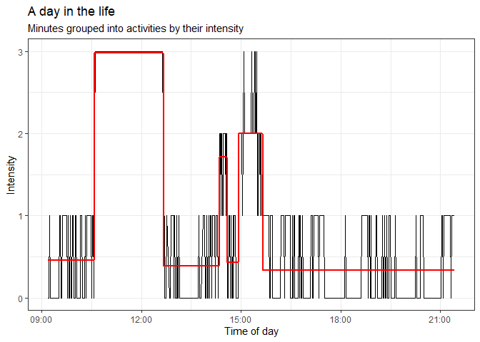
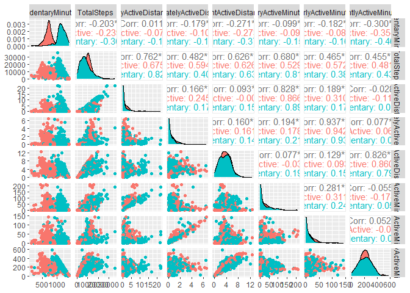

Data Analysis
================
Jeronimo Miranda
2023-05-18

``` r
library(changepoint)
library(ggplot2)
library(dplyr)
library(tidyr)
library(knitr)
```

## Preliminary

For the analysis, we use the clean data objects from the (Cleaning and
processing
step)\[<https://github.com/jerolon/FitBit_Tracker_Data_Analytics_Practice/blob/main/1_Data_Cleaning_and_manipulation.md>\]:

- dailyActivity, hourly2dailyActivity
- heartrate_minutes
- hourlyActivity, minute2hour
- minuteActivity, minuteAct_BPM
- sleepDay
- weightLogInfo

## Types of activities

I would like to infer the kind of activities that the users are doing
during the study. First, we want to check the daily data for a clue.
Because we have “Distance” and “Time” in the form of minutes, it is
irresistible to calculate velocities. We graph the velocity for each
intensity class.

<!-- -->

This is at the same time a sanity check (no one is travelling at 100
km/h, no sedentary velocity is significantly above 0), and an overview
of the kind of activities people are doing. A few jog (\> 6.5 km/h).
Most walk (or swim?).

Although the velocities are very well defined for each category, there
is quite the overlap. There are even some days with high or moderate
intensity but zero velocity. These are probably people on a stationary
bike, or lifting weights. Lower than average velocities could be people
hiking, swimming or going upstairs: intense activities that do not cover
much distance. This is hard to tell, however, because it is taking all
the minutes in a day, whereas a workout can combine periods of different
intensity activity.

We will use the data frame with minutes resolution to construct an
“Activities” data frame. Here, I want to aggregate the minutes in a user
day that have the same excercise intensity. To find the times when
intensity mean changes, we use the changepoint algorigthm mentioned
[here](https://rpubs.com/richkt/269908). We just pass the whole column,
since it is already arranged by Id and DateTime.

``` r
minuteAct_BPM <- arrange(minuteAct_BPM,Id,ActivityMinute )
#find the positions where the mean intensity changes
changepoint_position <- cpt.mean(minuteAct_BPM$Intensity,penalty='Manual',pen.value=8,method='PELT') %>% cpts()

minuteAct_BPM$IntensityChange <- rep(FALSE, nrow(minuteAct_BPM))
minuteAct_BPM$IntensityChange[changepoint_position + 1] <- TRUE
```

Now we have a column `IntensityChange` with value `TRUE` whenever we
detected a change in activity levels. Now we calculate another column
which gives us information on the time gap between records. We use the
combination of these two columns to cluster Activities by clustering
groups of adjacent records that have the same mean intensity and do not
have temporal jumps bigger than 10 minutes (because the user took off
the tracker or it is just a different day).

``` r
activities <- minuteAct_BPM %>% 
  #Will be true when activity changes
  mutate(#Timegap is true whenever there is a gap bigger than 10 minutes
         timegap = minutes(10) < abs(ActivityMinute - lag(ActivityMinute, def = first(ActivityMinute))),
         #ActivityChange will only be true when either the activity changes or there is a big time jump
         ActivityChange = IntensityChange | timegap,
         activityId = cumsum(ActivityChange)
         ) %>% select(-timegap, -ActivityChange, -IntensityChange)

n_distinct(activities$activityId)
```

    ## [1] 3284

The data frame `activities` contains grouped spans of time that have the
same mean intensity. To illustrate what I did, I plot the intensity for
every minute in a day from the user 8877689391. As you can see, the
intensity fluctuates normally. The red line is the mean intensity for
each activity (This day is divided into 7 activities). Around 12 pm
there is a long and very intense activity! Later, right after 15 there
is an activity comprised of minutes with 1,2, and 3 intensities. These
fluctuations are grouped together and the mean intensity of this
activity is 2.

<!-- -->

Now we can explore which properties the different activities have. In
the below graph we plot the mean cadence (how many steps per minute) and
the mean heart rate. Each dot is a single activity. The heart rate does
not really correlate with the cadence (there are many ways to get your
heart up without walking). The plot is faceted into different activity
categories based on mean intensity.

- Sedentary activities (Intensity mean 0) are defined by less than 120
  beats per minute and less than 25 steps per minute (This is a step
  every two seconds, so a bit active but not a continuous walk).
- Moderate intensity (1) activities are very clustered between 0-50
  steps per minute and 60-120 bpm, again, if you can imagine taking less
  than 1 step every second, this is not a walk. This are mainly standing
  activities with sporadic walking, maybe cooking, working, or chores.
- Fairly intense activities (2) are defined by 80-120 BPM and less than
  120 Steps per minute. I like how this category is so well defined by a
  BPM band, although it spans a wide spectrum in cadence.
- Last, the high intensity activities (3) are defined by either a \> 100
  BPM or \>80 BPM combined with a cadence greater than 100 steps per
  minute. This suggests that we could subdivide this category further
  into brisk walking, and intense stationary exercise this could be
  anything from swimming, weightlifting or cycling (which the
  accelerometer does not count as steps). There is also a very natural
  division at cadence \> 120 which we will call *jogging*.

<!-- -->

We will now explore intensities 0, 2, and 3 further and subdivide them.
Light intensity activities (1) are very well clustered. I am tempted to
name them as “Chores” or “Daily activities”.

#### Sedentary activities

More than half of activities are classified as sedentary. This could be
sleep activities or just activities sitting down. We classify as “Deep
Rest” whenever someone has a heart rate below 59 or average activity
intensity below 0.15. Anything else is classified as “Rest”. Below we
plot all the activities properties against each other and we see how
these two criteria are good at discriminating between groups of points.
Red are “Deep rest” activities and blue are “Rest” activities. I
specially like how the biggest peak for Deep rest is at \~600 minutes,
which could be the average sleep time.

<!-- -->

Looking only at the hour of the day at which the different activities
start, we have confidence that we are making a good subdivision. Most
“Deep rest” starts at 8PM, while most “Rest” activities start between 6
AM and 8 PM.

<!-- -->

#### Fairly intense activities

The next intensity class is well clustered and it is hard to subdivide.
Cadence and heart-rate are pretty flat. Duration is tipically 10
minutes, seldom more than an hour. There is, however, a funny pattern
when plotting mean intensity vs duration: when intensity is lower than
2, duration tends to rise with intensity, I call this cluster “Stroll”,
people are enjoying themselves. Higher than 2, intensity drops with
duration, because the peak density cadence of this cluster is higher
than 90, I call this cluster “Brisk walk”.

<!-- -->

While strolls happen throughout the day, medium walks happen mostly in
the afternoon.

<!-- -->

#### High intensity activity

For the highest intensity class, cadence offers a very clear way to
subdivide activities. A cadence below 60 is classified as a “workout”
which is any intense exercise that does not involve much walking. A
cadence between 60-120 is a brisk walk, a walk that is challenging, even
if it is not so fast. It could include people walking upstairs or
hiking. The last category is “Jogging”, where people are going more than
120 steps per minute, these tend to be the most intense, but are not so
numerous.

<!-- -->

The following code classifies the different activities according to the
criteria outlined above. It could be fun to use machine learning
algorithms to the activity data but this is beyond the business task
right now and I don’t think it would result in a significantly better
classification.

``` r
activity_summary <- activities %>% group_by(activityId) %>% summarise(Id = unique(Id),
    #Just divide the max time for the min time and normalize to minutes
    duration = (max(ActivityMinute) - min(ActivityMinute))/dminutes(1),
    #Activities with only one minute, should probably be deleted
    duration = if_else(duration == 0,1,duration),
    #cadence is the number of steps per minute
    cadence = sum(Steps)/duration,  hrate = mean(BPM),
    Int = mean(Intensity), calories = sum(Calories),
    #Using "round" because still want to keep it as factor
    Intensity_class = round(Int)) %>%
    #Separate by intensity class, then the conditions for each sub-class
  mutate(activity_name = case_when(
    Intensity_class == 3 ~ case_when(cadence < 60 ~ "Workout", between(cadence,60,120) ~ "Fast walk", cadence > 120 ~ "Jogging"),
    Intensity_class == 2 ~ if_else((Int > 2),  "Medium walk", "Stroll"),
    Intensity_class == 1 ~ "Normal activity",
    Intensity_class == 0 ~ if_else((hrate > 59 | Int > 0.15), "Rest", "Deep Rest"),
    TRUE ~ "Unclassified activity")) 
```

Most of the time, people spend either resting or going normally about
their day. Not in physical activity. Therefore, we filter out the
sedentary activities and normal life to get only physical activities,
however mild.

<!-- -->

A single user could be defined as a runner. Another user workouts in
more than 50% of their activities. However, the overall pattern is that
most activities done by people who use fitness trackers involve walking
with different intensities.

#### Activity Logging

We take a small detour to explore another trend in fitbit usage. We
examine the proportion of days in which users log an activity manually.
Overwhelmingly, users track their activities automatically. The total
distance that is manually logged is low, suggesting that this is not a
popular feature.

<!-- -->

This does not mean that you should eliminate the logged activities
feature. Although only 6 users logged any activity distance at all, for
these 6, the distance tracked by manual logging represents a substantial
percentage of the total distance they track. Moreover, even these users
do not log activities everyday, but they log a greater total distance on
the days that they manually log their activities.

<!-- -->

### Sedentarism

What’s the relationship between steps taken in a day and sedentary
minutes? How could this help inform the customer segments that we can
market to? E.g. position this more as a way to get started in walking
more? Or to measure steps that you’re already taking?

<!-- -->

This is very interesting, it suggests that we can segment users by those
that have more than 1000 sedentary minutes a day and those that have
less, lets do that. We will put the users who have more than 1000
Sedentary minutes more than half their dates on a group called
“Sedentary”.

``` r
dailyActivity <- dailyActivity %>% group_by(Id) %>% mutate(User_Segment = if_else(median(SedentaryMinutes) > 1000, "Sedentary", "Active"))
```

Now, sedentary users might want to minimize their total sedentary
minutes, at least to less than 1000, which would put them on the
“Active” group. We can check which of the variables minimizes the
sedentarism, in order to better help this group reach their goals. We
will plot the sedentary minutes against other variables and calculate
negative correlations. When we take a look at the left most column and
the top row, we see that, although total steps and sedentary minutes are
negatively correlated, the strongest negative correlation is
LightlyActive Minutes!

<!-- -->

This is expected – because a day only has 1440 minutes, if you spend at
least 440 minutes being a little active, then you cannot spend more than
1000 minutes inactive. Still, it suggests that for people that are
struggling to be more active, an emphasis on time doing some activity,
any activity, is likely to help them more achieve their goals, even on
days when they cannot reach the specified number of steps. When you look
at the bottom row of the graph below, it is clear that “Sedentary” users
are walking more than 5000 or even 10000 steps sometimes. Yet, despite
this, they are still very sedentary most days. This could suggest that
an emphasis on doing 10,000 steps a day might discourage people who do
not have the time every day, or that once they achieve this, they are
too tired to do much else.

<!-- -->

The great news is that, for users who are looking to be more active and
burning more calories, the relationship between steps and calories is
almost strictly linear. The benefits do not stop: 5,000 steps is better
than 0 steps, 10,000 steps is even better better, and the calories
burned keep increasing with the number of steps. You can still set a
target number of steps, but you should know that whatever activity you
do is valuable to stay healthy.

<!-- -->

### Resting heart rate

One interestign parameter that we can estimate is *resting heart rate*.
Although it can vary by age, in general, having a lower heart rate
implies more efficient heart function and better cardiovascular fitness.
We estimate it by filtering all the minutes with activity intensity 0
(“rest”) in a day and taking the mean. We then join it with the
dailyActivity data frame to compare it with the number of steps. We do
inner join to keep only records that are in both data frames.
Afterwards, we summarise again to get a single number for every Id.

``` r
day_rest_HR <- minuteAct_BPM %>% mutate(ActivityDate = date(ActivityMinute)) %>%
  group_by(Id, ActivityDate) %>% filter(Intensity == 0) %>% 
  summarise(Id = unique(Id), ActivityDate = unique(ActivityDate), resting_heart_rate = mean(BPM))

rhr_by_user <- inner_join(dailyActivity, day_rest_HR, by = c("Id", "ActivityDate")) %>% group_by(Id) %>%
  summarise(Id = unique(Id),
            across(c(resting_heart_rate, TotalSteps, VeryActiveDistance:LightActiveDistance, ends_with("Minutes"), Calories),
                   #just means that we apply the function mean to all the above columns
                   mean)
            
            )
```

Users that walk more tend to have a lower resting heart rate, but wait,
the three users with the lowest resting heart rate are not the ones that
take the most steps (gray rectangle). These same three users are also
among the ones with the least sedentary minutes (bottom left). The
strongest anti-correlation is with Very active minutes, suggesting that
the intensity of activities is more important than the number of steps.
Unfortunately, lightly active minutes has almost no bearing on
cardiovascular health. Overall, no activity explains everything because
it is a small sample and a noisy measurement. However, the correlations
are clear: move or walk intensely and try to not spend much time being
sedentary for better health.

<!-- -->

## Sleep and activity

We have sleep records for a subset of users. What’s the relationship
between minutes asleep and time in bed? You might expect it to be almost
completely linear - and it is. But there are examples of people that are
spending a typical amount of time in bed (6 to 10 hours), but are
getting less sleep than they think, and usually less than 7.5 hours,
which is recommended.

``` r
ggplot(data=sleepDay, aes(x=TotalMinutesAsleep/60, y=TotalTimeInBed/60)) + geom_point() + theme_bw() + labs(x = "Hours asleep", y = "Time in bed") + annotate("rect", xmin = 3.4, xmax = 7.5, ymin = 5, ymax = 11, alpha = 0.2) + scale_x_continuous(breaks = seq(0, 16, by = 2)) + scale_y_continuous(breaks = seq(0, 16, by = 2)) + geom_abline(col = "red", intercept = 0, slope = 1)
```

<!-- -->

Do participants who sleep more also take more steps or fewer steps per
day? Is there a relationship at all? How could these answers help inform
the marketing strategy of how you position this new product?

Amazingly, there is only a week correlation between total steps and
minutes asleep! And this correlation is negative, that is the more steps
you take, the fewer minutes you sleep. What is more surprising is the
anti-correlation with the number of sedentary minutes! I would have
expected completely the opposite, since sleep counts into sedentary
minutes (you are not very active when you are asleep), the more you
sleep, the more sedentary minutes you would spend.

It is hard to infer causation just from this correlation: on one hand,
having too little sleep can make you less active because you are tired;
on the other hand, not having enough activity can result in not being
able to fall asleep at night. In any case, the graphs further our
conclusion that the number of sedentary minutes is an important metric
to monitor your general health, including sleep.

<!-- -->

## Conclusions

In summary, although some specialized users use the tracker as a monitor
for running, the main trend of most users is to wear the device as they
go through their daily activities. Although users incorporate running
into their workouts, they do so very infrequently. Instead, most people
activity consists on walking at a slow to moderate pace, as well as
workouts that do not involve step count. The emphasis on step count is
justified, because most activities involve walking in different
intensities. However, many healthy activities cannot be detected by step
count: yoga, lifting weights, cycling, but are still detected as active
minutes. Moreover, other parameters are predictive of good health.
Therefore, most users would benefit from the tracker as a general
monitor of activity levels, calories, sleep, heart rate and more. The
device can be marketed as a general companion that gives you feedback on
your health goals, that are as diverse as users.
