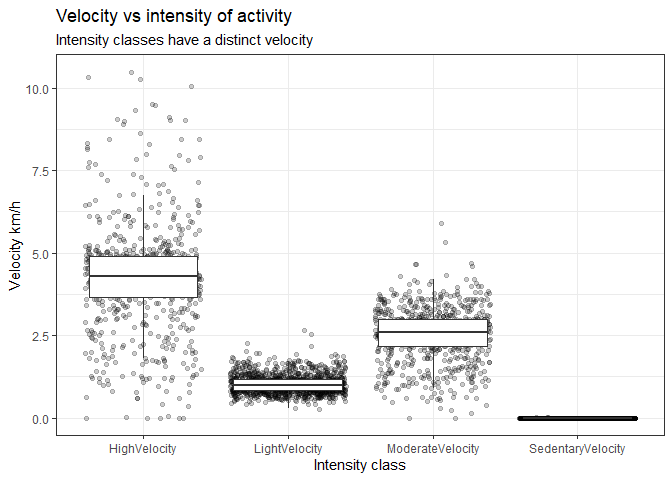
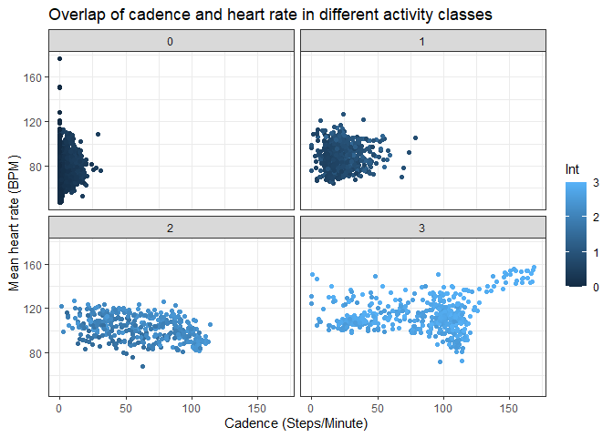
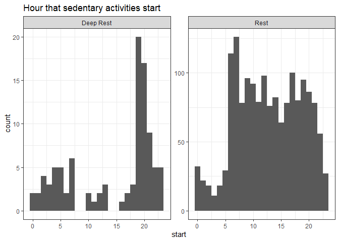
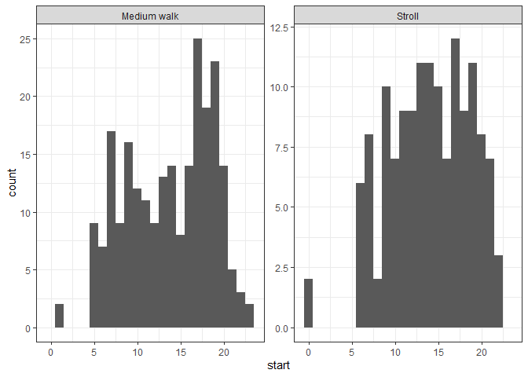
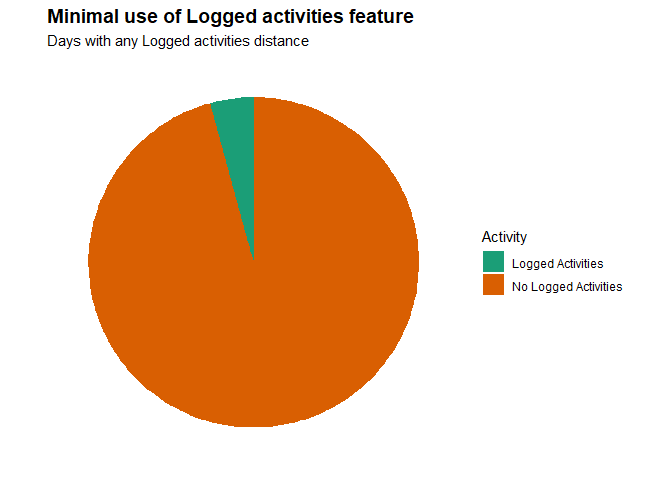
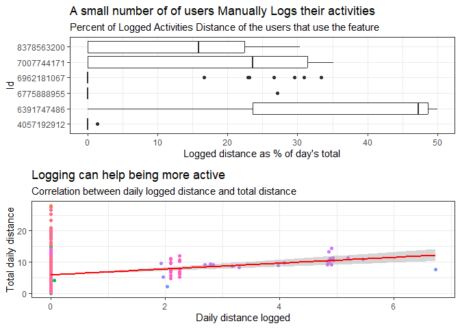

Data Analysis
================
Jeronimo Miranda
2023-05-18

``` r
library(changepoint)
library(ggplot2)
library(dplyr)
library(tidyr)
library(knitr)
```

## Intro

For the analysis, we use the clean data objects from the (cleaning and
processing
step)\[<https://github.com/jerolon/FitBit_Tracker_Data_Analytics_Practice/blob/main/1_Data_Cleaning_and_manipulation.md>\]:

- dailyActivity, hourly2dailyActivity
- heartrate_minutes
- hourlyActivity, minute2hour
- minuteActivity, minuteAct_BPM
- sleepDay
- weightLogInfo

## Plotting a few explorations

I would like to infer the kind of activities that the users are doing
during the study. First, we want to check the daily data for a clue. We
graph the velocity for each intensity class.

<!-- -->

This is at the same time a sanity check (no one is travelling at 100
km/h, no sedentary velocity is significantly above 0) and an overview of
the kind of activities people are doing. A few jog. Most walk (or
swim?). The zero velocities in all categories apart from sedentary are
probably people on a stationary bike, or lifting weights. Lower than
average velocities could be people hiking, swimming or going upstairs:
intense activities that do not cover much distance. This is hard to
tell, however, because it is taking all the minutes in a day, whereas a
workout can combine different intensities, it is hard to maintain a
peak.

We will use the data frame with minute resolution to construct an
“Activities” data frame. Here, I want to aggregate the minutes in a user
day that have the same excercise intensity. To find the times when
intensity mean changes, we use the changepoint algorigthm mentioned
[here](https://rpubs.com/richkt/269908). We just pass the whole column,
since it is already arranged by Id and DateTime.

``` r
minuteAct_BPM <- arrange(minuteAct_BPM,Id,ActivityMinute )
#find the positions where the mean intensity changes
changepoint_position <- cpt.mean(minuteAct_BPM$Intensity,penalty='Manual',pen.value=8,method='PELT') %>% cpts()

minuteAct_BPM$IntensityChange <- rep(FALSE, nrow(minuteAct_BPM))
minuteAct_BPM$IntensityChange[changepoint_position + 1] <- TRUE
```

Now we have a column `IntensityChange` that is `TRUE` whenever we
detected a change in activity levels. Now we calculate another column
which gives us information on the time gap between records. We use the
combination of these two columns to cluster Activities by clustering
groups of adjacent records that have the same mean intensity and do not
have temporal jumps bigger than 10 minutes.

``` r
activities <- minuteAct_BPM %>% 
  #Will be true when activity changes
  mutate(#Timegap is true whenever there is a gap bigger than 10 minutes
         timegap = minutes(10) < abs(ActivityMinute - lag(ActivityMinute, def = first(ActivityMinute))),
         #ActivityChange will only be true when either the activity changes or there is a big time jump
         ActivityChange = IntensityChange | timegap,
         activityId = cumsum(ActivityChange)
         ) %>% select(-timegap, -ActivityChange, -IntensityChange)

n_distinct(activities$activityId)
```

    ## [1] 3284

We have now the same dataframe where we have grouped spans of time that
are similar in Intensity. Now we can explore which properties they have.
If we group by the mean Intensity, we have four groups of activities,
you can see that they are mostly separated by heart rate. We also plot
“cadence” which is steps per minute.

- Sedentary activities (Intensity mean 0) are defined by less than 90
  beats per minute and less than 25 steps per minute (This is a step
  every two seconds, so a bit active but not a continuous walk).
- Moderate intensity (1) activities are very clustered between 0-50
  steps per minute and 60-90 bpm, again, if you can imagine taking less
  than 1 step every second, this is not a walk. This are mainly standing
  activities with sporadic walking, maybe cooking, working, or chores.
- Fairly intense activities (2) are mainly defined by 80-120 BPM and
  less than 100 Steps per minute. I like how this category is so well
  defined by a BPM band, and it could be further subdivided by cadence.
- Last, the high intensity activities (3) are defined by either a \> 100
  BPM or \>80 BPM combined with a cadence greater than 100 steps per
  minute. This suggests that we could subdivide this category further
  into brisk walking, and intense stationary exercise this could be
  anything from swimming, weightlifting or cycling (which the
  accelerometer does not count as steps). There is also a very natural
  division at cadence \> 120 which we will call *jogging*.  
  <!-- --> We
  will now explore intensities 0, 2, and 3 further and subdivide them.
  Light intensity activities (1) are very well clustered. I am tempted
  to name them as “Chores” or “Daily activities”.

#### Sedentary activities

More than half of activities are classified as sedentary. This could be
sleep activities or just activities sitting down. We classify whenever
someone has a heartrate below 59 or average activity intensity below
0.15, as “Deep Rest”, and anything else as just “Rest”. Below we plot
all the activities properties against each other and we see how these
two criteria are good at discriminating between groups of points. I
specially like how the biggest peak for Deep rest is at \~600 minutes,
which could be the average sleep time.

<!-- -->

Looking only at the hour of the day at which the different activities
start, ww have confidence that we are making a good subdivision. Most
“Deep rest” starts at 8PM, while most “Rest” activities start between 6
AM and 8 PM.

<!-- -->

#### Fairly intense activities

The next intensity class is well clustered by heart rate and it is hard
to subdivide. Cadence and heart-rate are pretty flat, and they last
tipically 10 minutes, seldom more than an hour. There is, however, a
funny pattern when plotting mean intensity vs duration: when intensity
is lower than 2, duration tends to rise with intensity, I call this
cluster “Stroll”, people are enjoying themselves. Higher than 2,
intensity drops with duration, because the peak density cadence of this
cluster is higher than 90, I call this cluster “Brisk walk”.

<!-- -->

While strolls happen troughout the day, medium walks happen mostly in
the afternoon.

<!-- -->

For the last intensity class, cadence offers a very clear way to
subdivide activities. A cadence below 60 is classified as a “workout”
which is any intense excercise that does not involve much walking. A
cadence between 60-120 is a brisk walk, a walk that is challenging, even
if it is not so fast. It could include people walking upstairs or
hiking. The last categorie is “Jogging”, where people are going more
than 120 steps per minute, these tend to be the most intense and last
roughly 1 hour.

<!-- -->

#### High intensity activity

<!-- -->

``` r
activity_summary <- activities %>% group_by(activityId) %>% summarise(Id = unique(Id),
    #Just divide the max time for the min time and normalize to minutes
    duration = (max(ActivityMinute) - min(ActivityMinute))/dminutes(1),
    #Activities with only one minute, should probably be deleted
    duration = if_else(duration == 0,1,duration),
    #cadence is the number of steps per minute
    cadence = sum(Steps)/duration,  hrate = mean(BPM),
    Int = mean(Intensity), calories = sum(Calories),
    #Using "round" because still want to keep it as factor
    Intensity_class = round(Int)) %>%
    #Separate by intensity class, then the conditions for each sub-class
  mutate(activity_name = case_when(
    Intensity_class == 3 ~ case_when(cadence < 60 ~ "Workout", between(cadence,60,120) ~ "Fast walk", cadence > 120 ~ "Jogging"),
    Intensity_class == 2 ~ if_else((Int > 2),  "Medium walk", "Stroll"),
    Intensity_class == 1 ~ "Normal activity",
    Intensity_class == 0 ~ if_else((hrate > 59 | Int > 0.15), "Rest", "Deep Rest"),
    TRUE ~ "Unclassified activity")) 
```

Most of the time, people spend either resting or going normally about
their day. Not in physical activity. Therefore, we filter out the
sedentary activities and normal life to get only physical activities,
however mild.

``` r
library("gridExtra")
pie <- activity_summary %>% group_by(activity_name) %>% summarise(number = n()) %>% filter(!stringr::str_ends(activity_name, "Rest"), activity_name != "Normal activity") %>%  ggplot(aes(x="", y = number, fill = activity_name)) + geom_bar(width = 1, stat = "identity") + coord_polar("y", start = 0) + scale_fill_brewer(name = "Activity", palette = "Dark2") + theme_minimal() + blank_theme + theme(axis.text.x=element_blank()) + labs(title = "Tipes of activities of fitbit users", subtitle = "Fitbit user activity is dominated by walking")

bar <- activity_summary %>% group_by(Id,activity_name) %>% summarise(number = n()) %>% filter(!stringr::str_ends(activity_name, "Rest"), activity_name != "Normal activity") %>% mutate(perc = 100 * number/sum(number)) %>%  ggplot(aes(y=Id, x = perc, fill = activity_name)) + geom_bar(width = 0.7, stat = "identity") + scale_fill_brewer(palette = "Dark2") + theme_bw() + theme(axis.text.y = element_blank(), legend.position="none") + labs(subtitle = "Activity type by user", x = "Percentage", y = "User")

grid.arrange(pie, bar, ncol = 2)
```

<!-- -->

Most activities done by people involve walking. When people exercise,
they tend not to run.

### Sedentarism

What’s the relationship between steps taken in a day and sedentary
minutes? How could this help inform the customer segments that we can
market to? E.g. position this more as a way to get started in walking
more? Or to measure steps that you’re already taking?

``` r
ggplot(data=dailyActivity, aes(x=TotalSteps, y=SedentaryMinutes)) + geom_point() + theme_bw()
```

<!-- -->

What could these trends tell you about how to help market this product?
Or areas where you might want to explore further?

Note that there were more participant Ids in the daily activity dataset
that have been filtered out using merge. Consider using ‘outer_join’ to
keep those in the dataset.

This is just one example of how to get started with this data - there
are many other files and questions to explore as well!

## Sleep and activity

What’s the relationship between minutes asleep and time in bed? You
might expect it to be almost completely linear - are there any
unexpected trends?

``` r
ggplot(data=sleepDay, aes(x=TotalMinutesAsleep, y=TotalTimeInBed)) + geom_point() + theme_bw()
```

<!-- -->

Now you can explore some different relationships between activity and
sleep as well. For example, do you think participants who sleep more
also take more steps or fewer steps per day? Is there a relationship at
all? How could these answers help inform the marketing strategy of how
you position this new product?
